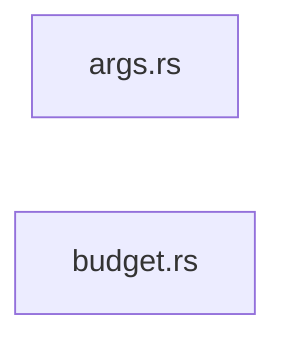

# Sephera

[](https://github.com/Reim-developer/Sephera/actions/workflows/ci.yml)
[](https://sephera.vercel.app)
[](https://crates.io/crates/sephera)
[](LICENSE)

Sephera is a Rust CLI for understanding codebases fast.

Count a repository, build a deterministic AI-ready context pack, trace dependency blast radius, or expose the same workflows through MCP from one binary.

Documentation: <https://sephera.vercel.app>

Current release line: `v0.5.0` (pre-1.0).

Sephera currently focuses on four practical commands:

- `loc`: fast, language-aware line counting across project trees
- `context`: deterministic Markdown or JSON bundles with AST compression, focus paths, and Git diff awareness
- `graph`: dependency graph analysis via Tree-sitter import extraction
- `mcp`: built-in MCP server for direct AI agent integration

It is intentionally narrow in scope. Sephera does not try to be an agent runtime, a hosted service, or a provider-specific AI wrapper.

New in `v0.5.0`: URL mode for `loc`, `context`, and `graph`, including GitHub/GitLab tree URLs, remote config discovery, and MCP support.

## Why Sephera

Most codebase tools stop at one layer:

- metrics tools tell you how large a repository is
- AI helpers try to ingest too much code at once
- graph tools explain structure but not how to package it for review or prompting

Sephera connects those layers. It turns repository structure into something you can act on:

- inspect a local repo or a public repo URL without cloning first
- build a deterministic Markdown or JSON pack that fits a real token budget
- trace reverse dependencies before changing a shared module
- keep shared defaults in `.sephera.toml`
- expose the same workflows directly to AI agents through MCP

If you only need raw LOC, `cloc` and `tokei` already do that well. Sephera matters when you need the next step too.

## Try Sephera

```bash
cargo install sephera

sephera loc --url https://github.com/Reim-developer/Sephera
sephera context --url https://github.com/Reim-developer/Sephera/tree/master/crates/sephera_core --compress signatures --budget 32k
sephera graph --url https://github.com/Reim-developer/Sephera --what-depends-on crates/sephera_core/src/core/runtime/source.rs --depth 1
sephera mcp
```

Those four commands cover the core use case: inspect a repo, build a focused pack, trace impact, then wire the same capabilities into an agent.

## What Sephera Does

- `loc`: fast, language-aware repository metrics with terminal table output and newline portability across `LF`, `CRLF`, and classic `CR`
- `context`: deterministic Markdown or JSON bundles with focus paths, Git diff awareness, token budgets, AST compression, and export-ready output
- `graph`: semantic dependency graph analysis with reverse dependency queries, depth filtering, cycle detection, and export to JSON, Markdown, XML, or DOT
- `mcp`: built-in MCP server exposing `loc`, `context`, and `graph` over stdio for Claude Desktop, Cursor, and other MCP-compatible clients

## Feature Highlights

- URL mode: analyze cloneable repo URLs plus GitHub and GitLab tree URLs directly, with `--ref` support for repo URLs
- AST compression: use Tree-sitter-powered `signatures` or `skeleton` modes to reduce token usage by 50-70% while preserving API shape
- Review-friendly context: center packs on `HEAD~1`, `origin/master`, or remote base refs, then keep the result deterministic and machine-readable
- Dependency impact analysis: find what depends on a file, limit traversal depth, and export architecture views without switching tools
- Repo-level defaults: keep team-wide `context` settings in `.sephera.toml`, then layer named profiles and CLI overrides on top
- Agent integration: expose the same local engines through MCP instead of wrapping shell scripts around CLI commands
- Stability work: reproducible benchmarks, regression suites, fuzz targets, and generated built-in language metadata from [`config/languages.yml`](config/languages.yml)

## Install

Install the published CLI from `crates.io`:

```bash
cargo install sephera
```

If you do not want a local Rust toolchain, download a prebuilt archive from [GitHub Releases](https://github.com/Reim-developer/Sephera/releases). Release assets ship as zipped or tarball binaries for the mainstream desktop targets supported by the release workflow.

If you are working from source instead, see the contributor workflow in the docs.

## Quick Start

The examples below assume a `sephera` binary is available on your `PATH`.

Count lines of code in the current repository:

```bash
sephera loc --path .
```

Inspect a public repository directly from a URL:

```bash
sephera loc --url https://github.com/Reim-developer/Sephera
```

Build a focused context pack for a local repository:

```bash
sephera context --path . --focus crates/sephera_core --format json --output reports/context.json
```

Build a context pack from a remote repository tree URL:

```bash
sephera context --url https://github.com/Reim-developer/Sephera/tree/master/crates/sephera_core --format json
```

Compress context excerpts to reduce token usage:

```bash
sephera context --path . --compress signatures --budget 64k
```

Build a review-focused pack from Git changes:

```bash
sephera context --path . --diff HEAD~1 --budget 32k
```

The same base-ref workflow works in URL mode:

```bash
sephera context --url https://github.com/Reim-developer/Sephera --ref master --diff HEAD~1 --budget 32k
```

In URL mode, `context --diff` accepts base refs such as `main`, `master`, `HEAD~1`, tags, or commit SHAs. Working-tree modes (`working-tree`, `staged`, `unstaged`) are intentionally rejected because remote checkouts are clean temp clones.

Analyze the dependency graph for the codebase:

```bash
sephera graph --path . --format markdown
sephera graph --path . --focus crates/sephera_core --format dot
```

Analyze a tagged remote repository revision:

```bash
sephera graph --url https://github.com/Reim-developer/Sephera --ref v0.5.0 --format markdown
```

Trace reverse dependency impact before changing a file:

```bash
sephera graph --path . --what-depends-on crates/sephera_core/src/core/runtime/source.rs --depth 1
```

Start MCP server for AI agent integration:

```bash
sephera mcp
```

List the profiles available for the current repository:

```bash
sephera context --path . --list-profiles
```

Configure repo-level defaults for `context`:

```toml
[context]
focus = ["crates/sephera_core"]
budget = "64k"
compress = "signatures"
format = "markdown"
output = "reports/context.md"

[profiles.review.context]
diff = "origin/master"
focus = ["crates/sephera_core", "crates/sephera_cli"]
budget = "32k"
output = "reports/review.md"
```

The configuration model is documented in more detail on the docs site, including discovery rules, precedence, path resolution, field-by-field behavior for `[context]`, and named profiles under `[profiles.<name>.context]`.

## AST Compression

Sephera can compress source files using Tree-sitter to extract only structural information such as function signatures, type definitions, imports, and trait declarations while replacing implementation bodies with `{ ... }`.

This typically reduces token usage by 50-70% without losing the API surface or architectural overview of the codebase.

Supported languages: Rust, Python, TypeScript, JavaScript, Go, Java, C++, C.

```bash
sephera context --path . --compress signatures --budget 64k
sephera context --path . --compress skeleton
```

## MCP Server

Sephera includes a built-in MCP (Model Context Protocol) server that exposes `loc`, `context`, and `graph` as tools over stdio transport.

This allows AI agents such as Claude Desktop, Cursor, and other MCP-compatible clients to call Sephera directly without shell wrappers.

```bash
sephera mcp
```

Example MCP client configuration (Claude Desktop):

```json
{
  "mcpServers": {
    "sephera": {
      "command": "sephera",
      "args": ["mcp"]
    }
  }
}
```

## Terminal Demos

`loc` produces a fast, readable terminal summary for project trees:

```text
Scanning: crates                                  

╭──────────┬──────┬─────────┬───────┬─────────╮
│ Language ┆ Code ┆ Comment ┆ Empty ┆    Size │
│          ┆      ┆         ┆       ┆ (bytes) │
╞══════════╪══════╪═════════╪═══════╪═════════╡
│ Rust     ┆ 9724 ┆     652 ┆  1357 ┆  358209 │
│ TOML     ┆  113 ┆       0 ┆    11 ┆    3493 │
│ Markdown ┆   69 ┆       0 ┆    35 ┆    2980 │
│ Totals   ┆ 9906 ┆     652 ┆  1403 ┆  364682 │
╰──────────┴──────┴─────────┴───────┴─────────╯
Files scanned: 88
Languages detected: 3
Elapsed: 3.909 ms (0.003909 s)
```

`context` builds a structured pack that can be exported for people or tooling:


`graph` builds dependency graphs with cycle detection and exports to Markdown/Mermaid:

```markdown
# Dependency Graph Report

**Base path:** `crates`

## Summary

| Metric                | Value |
| --------------------- | ----- |
| Files analyzed        | 82    |
| Internal edges        | 48    |
| External edges        | 495   |
| Circular dependencies | 0     |

## Dependency Diagram



`mcp` seamlessly hooks AI agents up to your codebase without wrappers using standard JSON-RPC over `stdio`:

```json
--> { "jsonrpc": "2.0", "id": 1, "method": "tools/call", "params": { "name": "loc", "arguments": { "path": "crates" } } }

<-- {
      "jsonrpc": "2.0",
      "id": 1,
      "result": {
        "content": [{
          "type": "text",
          "text": "Scanning: crates\n\n╭──────────┬──────┬─────────┬───────┬─────────╮\n│ Language ┆ Code ┆ Comment ┆ Empty ┆    Size │..."
        }]
      }
    }
```

## Benchmarks

The benchmark harness is Rust-only and measures the local CLI over deterministic datasets.

- Default datasets: `small`, `medium`, `large`
- Optional datasets: `repo`, `extra-large`
- `extra-large` targets roughly 2 GiB of generated source data and is intended as a manual stress benchmark

Useful commands:

```bash
python benchmarks/run.py
python benchmarks/run.py --datasets repo small medium large
python benchmarks/run.py --datasets extra-large --warmup 0 --runs 1
```

Benchmark methodology, dataset policy, and caveats are documented in [`benchmarks/README.md`](benchmarks/README.md) and on the docs site.

## Documentation

Public documentation: <https://sephera.vercel.app>

Docs source lives in [`docs/`](docs/), built as a static Astro Starlight site.

Useful local docs commands:

```bash
npm run docs:dev
npm run docs:build
npm run docs:preview
```

## Workspace Layout

- `crates/sephera_cli`: CLI argument parsing, command dispatch, config resolution, and output rendering
- `crates/sephera_core`: shared analysis engine, traversal, ignore matching, `loc`, and `context`
- `crates/sephera_mcp`: MCP server implementation (Model Context Protocol)
- `crates/sephera_tools`: explicit code generation and synthetic benchmark corpus generation
- `config/languages.yml`: editable source of truth for built-in language metadata
- `benchmarks/`: benchmark harness, generated corpora, reports, and methodology notes
- `docs/`: public documentation site
- `fuzz/`: fuzz targets, seed corpora, and workflow documentation

## Development Checks

```bash
cargo fmt --all --check
cargo clippy --workspace --all-targets --all-features -- -D warnings
cargo test --workspace
npm run pyright
```

## License

This repository is distributed under the GNU General Public License v3.0. See [`LICENSE`](LICENSE) for the full text.
