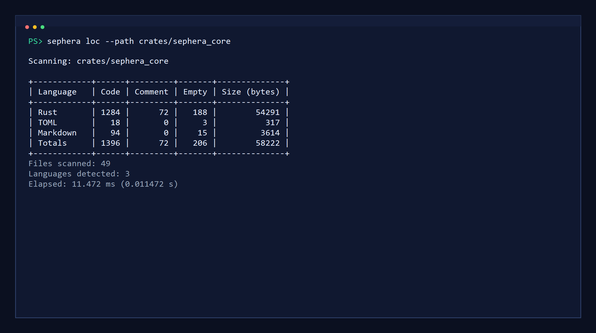
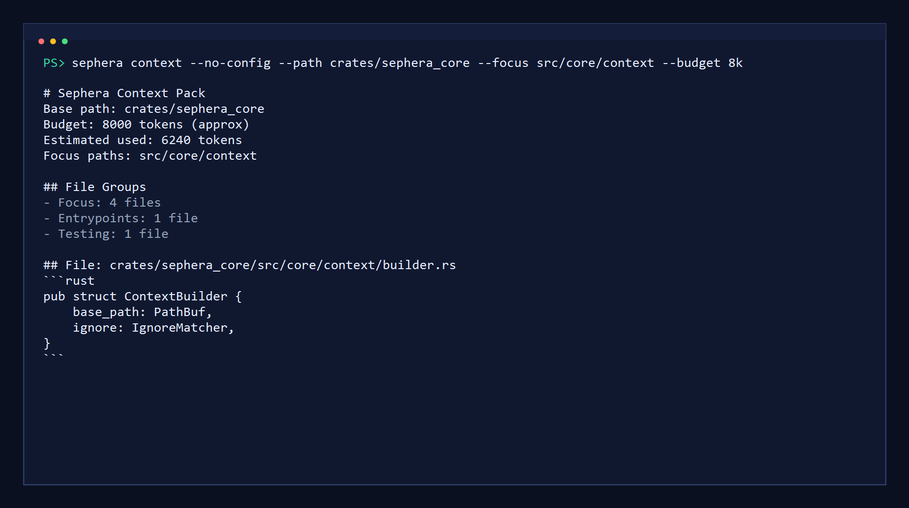

# Sephera

[](https://github.com/Reim-developer/Sephera/actions/workflows/ci.yml)
[](https://sephera.vercel.app)
[](LICENSE)

Sephera is a local-first Rust CLI for two jobs that are usually split across separate tools: repository metrics and deterministic context export.

Documentation: <https://sephera.vercel.app>

Current release line: `v0.2.1` (pre-1.0).

Sephera currently focuses on two practical commands:

- `loc`: fast, language-aware line counting across project trees
- `context`: deterministic Markdown or JSON bundles that stay within real prompt budgets

It is intentionally narrow in scope. Sephera does not try to be an agent runtime, a hosted service, or a provider-specific AI wrapper.

## Why Sephera

Most codebase tooling falls into one of two buckets:

- metrics tools that tell you how large a repository is
- AI helpers that try to ingest too much code at once

Sephera sits between those extremes. It gives you reliable structural signals from the repository, then turns those signals into focused context that is easier for both humans and LLMs to work with.

## Why not `cloc` or `tokei`?

If you only need line counts, `cloc` and `tokei` are excellent tools and already solve that job well.

Sephera is useful when you need more than raw totals:

- `loc` is only one half of the workflow
- `context` turns repository structure into deterministic Markdown or JSON bundles
- `.sephera.toml` lets teams keep shared context defaults in the repository
- focus paths and approximate token budgets make output more practical for LLM use

The goal is not to replace every code metrics tool. The goal is to pair trustworthy repository signals with context export that is actually usable in modern review and AI-assisted workflows.

## Key Features

- Fast `loc` analysis with per-language totals, terminal table output, and elapsed-time reporting
- Deterministic `context` packs with focus-path prioritization, approximate token budgeting, and export to Markdown or JSON
- Repo-level `context` defaults and named profiles through `.sephera.toml`, with CLI flags overriding config
- Generated built-in language metadata sourced from [`config/languages.yml`](config/languages.yml)
- Byte-oriented scanning with newline portability for `LF`, `CRLF`, and classic `CR`
- Reproducible benchmark harness, regression suites, and fuzz targets for stability work

## Common Uses

- Inspect a repository before refactoring or reviewing changes
- Build a focused context bundle for ChatGPT, Claude, Gemini, or internal tooling
- Prepare a structured handoff for another engineer or agent
- Export machine-readable context for downstream automation

## Install

Install the published CLI from `crates.io`:

```bash
cargo install sephera
```

If you do not want a local Rust toolchain, download a prebuilt archive from [GitHub Releases](https://github.com/Reim-developer/Sephera/releases). Release assets ship as zipped or tarball binaries for the mainstream desktop targets supported by the release workflow.

If you are working from source instead, see the contributor workflow in the docs.

## Quick Start

The examples below assume a `sephera` binary is available on your `PATH`.

Count lines of code in the current repository:

```bash
sephera loc --path .
```

Build a focused context pack and export it to JSON:

```bash
sephera context --path . --focus crates/sephera_core --format json --output reports/context.json
```

List the profiles available for the current repository:

```bash
sephera context --path . --list-profiles
```

Configure repo-level defaults for `context`:

```toml
[context]
focus = ["crates/sephera_core"]
budget = "64k"
format = "markdown"
output = "reports/context.md"

[profiles.review.context]
focus = ["crates/sephera_core", "crates/sephera_cli"]
budget = "32k"
output = "reports/review.md"
```

The configuration model is documented in more detail on the docs site, including discovery rules, precedence, path resolution, field-by-field behavior for `[context]`, and named profiles under `[profiles.<name>.context]`.

## Terminal Demos

`loc` produces a fast, readable terminal summary for project trees:



`context` builds a structured pack that can be exported for people or tooling:



## Benchmarks

The benchmark harness is Rust-only and measures the local CLI over deterministic datasets.

- Default datasets: `small`, `medium`, `large`
- Optional datasets: `repo`, `extra-large`
- `extra-large` targets roughly 2 GiB of generated source data and is intended as a manual stress benchmark

Useful commands:

```bash
python benchmarks/run.py
python benchmarks/run.py --datasets repo small medium large
python benchmarks/run.py --datasets extra-large --warmup 0 --runs 1
```

Benchmark methodology, dataset policy, and caveats are documented in [`benchmarks/README.md`](benchmarks/README.md) and on the docs site.

## Documentation

Public documentation: <https://sephera.vercel.app>

Docs source lives in [`docs/`](docs/), built as a static Astro Starlight site.

Useful local docs commands:

```bash
npm run docs:dev
npm run docs:build
npm run docs:preview
```

## Workspace Layout

- `crates/sephera_cli`: CLI argument parsing, command dispatch, config resolution, and output rendering
- `crates/sephera_core`: shared analysis engine, traversal, ignore matching, `loc`, and `context`
- `crates/sephera_tools`: explicit code generation and synthetic benchmark corpus generation
- `config/languages.yml`: editable source of truth for built-in language metadata
- `benchmarks/`: benchmark harness, generated corpora, reports, and methodology notes
- `docs/`: public documentation site
- `fuzz/`: fuzz targets, seed corpora, and workflow documentation

## Development Checks

```bash
cargo fmt --all --check
cargo clippy --workspace --all-targets --all-features -- -D warnings
cargo test --workspace
npm run pyright
```

## License

This repository is distributed under the GNU General Public License v3.0. See [`LICENSE`](LICENSE) for the full text.
