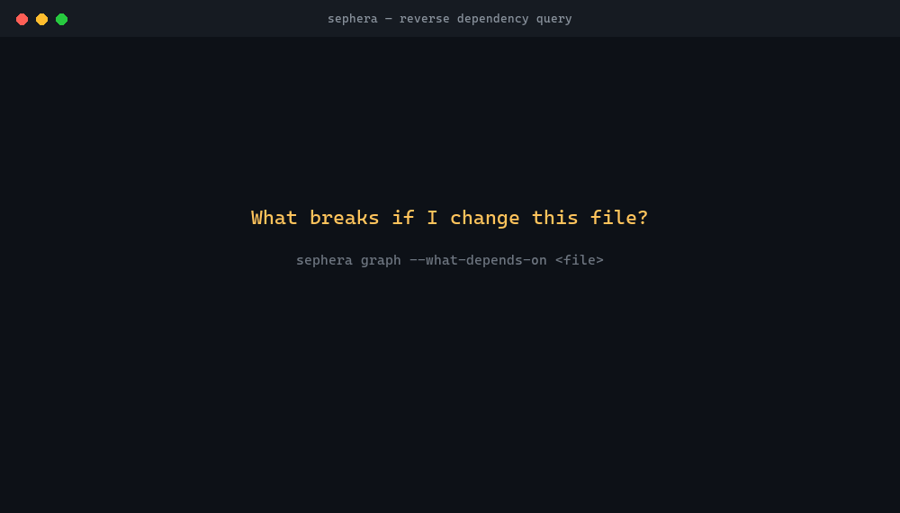
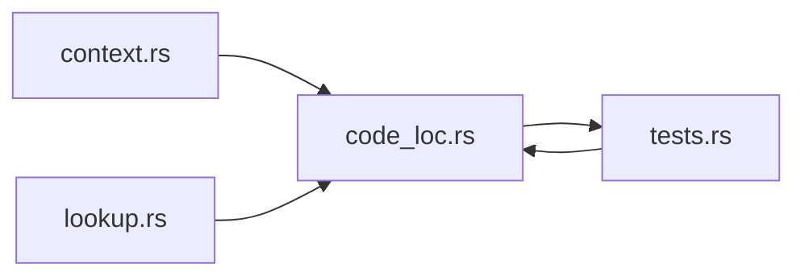

# Sephera

[](https://github.com/Reim-developer/Sephera/actions/workflows/ci.yml)
[](https://crates.io/crates/sephera)
[](https://sephera.vercel.app)
[](LICENSE)

**Know what breaks before you touch it.**

You are about to edit a shared module. Which files depend on it?

`grep` finds text matches, not call paths. Your IDE guesses. An LLM hallucinates a confident wrong answer.

Sephera builds a real dependency graph from your actual `import` / `use` / `#include` statements, then answers that question exactly.

```bash
cargo install sephera
```

---

## See it work

You want to refactor `code_loc.rs`. Run Sephera on Sephera:

```bash
sephera graph --path . --what-depends-on crates/sephera_core/src/core/code_loc.rs
```



The same query with `--format markdown`:

````markdown
# Dependency Graph Report

**Base path:** `.`

**Query:** `depends_on:crates/sephera_core/src/core/code_loc.rs`

## Summary

| Metric                | Value |
|-----------------------|-------|
| Files analyzed        | 4     |
| Internal edges        | 7     |
| External edges        | 19    |
| Declared dependencies | 8     |
| Local crate edges     | 0     |
| Standard library edges| 11    |
| Circular dependencies | 0     |

## Most Imported Files

| File                                      | Imported by |
|-------------------------------------------|-------------|
| `crates/sephera_core/src/core/code_loc.rs`| 6           |

## Most Importing Files

| File                                                | Imports |
|-----------------------------------------------------|---------|
| `crates/sephera_core/src/core/code_loc/tests.rs`    | 4       |
| `crates/sephera_core/src/core/runtime/context.rs`  | 1       |
| `crates/sephera_core/src/core/symbols/lookup.rs`    | 1       |

## Dependency Diagram


```mermaid
graph LR
    n0["code_loc.rs"]
    n1["tests.rs"]
    n2["context.rs"]
    n3["lookup.rs"]
    n0 --> n1
    n1 --> n0
    n2 --> n0
    n3 --> n0
```
````

**Six references reach `code_loc.rs`, from three files.** You now know your blast radius before opening the file — not after CI turns red.

The query filters to the blast radius, which is why the report above shows four files rather than the whole repository.

---

## It finds real bugs

Run the full graph scan on this repository:

```bash
sephera graph --path . --format markdown
```

Real output:

````markdown
# Dependency Graph Report

**Base path:** `.`

## Summary

| Metric                | Value |
|-----------------------|-------|
| Files analyzed        | 132   |
| Internal edges        | 478   |
| External edges        | 514   |
| Unresolved local paths| 2     |
| Declared dependencies | 177   |
| Local crate edges     | 114   |
| Standard library edges| 179   |
| Circular dependencies | 0     |

## Dependencies

| Package            | Kind     | Version   | Import paths |
|--------------------|----------|-----------|--------------|
| `std`              | stdlib   | unknown   | 169 |
| `sepheracore`      | workspace| unknown   | 107 |
| `anyhow`           | declared | 1.0.102   | 65  |
| `tempfile`         | declared | 3.27.0    | 30  |
| `comfytable`       | declared | 7.2.2     | 11  |
| `clap`             | declared | 4.6.0     | 10  |
````

The three numbers that used to be one are now three: 114 edges reach a crate in this workspace and 179 reach the standard library, so the 514 "external" edges are mostly other people's code. That is what makes the table answer *"which dependency do I bump"* rather than just *"how many edges are there"*.

Cycles are found by iterative DFS over the resolved import graph, with back-edge
detection and deduplication so each cycle is reported once. This repository
reports 0, and it took real fixes to get there: the cycles it used to report were
module-tree artifacts — a parent declaring a child and the child naming its parent
with `super::` — not dependencies you could act on. An early version of this tool
advertised two "found in its own source tree" cycles for exactly that reason.

---

## Where Sephera fits

Being straight about this, because the crowded ones do not:

| Capability | Sephera | repomix | cloc / tokei |
|---|:---:|:---:|:---:|
| **Reverse dependencies** — what breaks if I edit this? | ✅ | ❌ | ❌ |
| **Circular dependency detection** | ✅ | ❌ | ❌ |
| **Graph export** — DOT, Mermaid, XML, JSON | ✅ | ❌ | ❌ |
| **Token-budgeted context packs** | ✅ | ✅ | ❌ |
| Tree-sitter AST compression | ✅ | ✅ | ❌ |
| Pack a repo into one AI-friendly file | ✅ | ✅ | ❌ |
| MCP server | ✅ | ✅ | ❌ |
| Claude Code plugins / Agent Skills | ❌ | ✅ | ❌ |
| Browser & VS Code extensions | ❌ | ✅ | ❌ |
| Code / comment / blank per-language LOC | ✅ | ❌ | ✅ |
| Single static Rust binary, no runtime deps | ✅ | ❌ (Node) | ✅ |
| Remote repo URL, no manual clone | ✅ | ✅ | ❌ |

**Read that honestly:** if you want a repo flattened into one XML file with a browser extension and Claude Code plugins, use [repomix](https://github.com/yamadashy/repomix). It is excellent and far more popular.

Use Sephera when you need the **dependency structure** — what imports this, what would break, are there cycles, and how do I fit this within a token budget.

---

## Install

```bash
cargo install sephera
```

No Rust toolchain? Grab a prebuilt binary from [GitHub Releases](https://github.com/Reim-developer/Sephera/releases) for Windows, macOS, or Linux.

Current release line: `v0.5.0` (pre-1.0).

---

## The four commands

### `graph` — dependency structure and blast radius

Works on Rust, Python, TypeScript, JavaScript, Go, Java, C, and C++.

```bash
# Full dependency report
sephera graph --path .

# Human-readable with Mermaid diagram
sephera graph --path . --format markdown

# Blast radius: everything that transitively imports a file
sephera graph --path . --what-depends-on src/core/session.rs

# Limit how far the impact spreads
sephera graph --path . --what-depends-on src/core/session.rs --depth 1

# Scope analysis to a subtree, export for Graphviz
sephera graph --path . --focus crates/sephera_core --format dot --output deps.dot

# Analyze any public repo without cloning it yourself
sephera graph --url https://github.com/owner/repo --format markdown
```

`--what-depends-on` traverses the graph **in reverse** from the target, so you get real transitive dependents rather than direct importers.

### `context` — token-budgeted packs for LLMs

```bash
# Focus a subtree, compress, and cap the budget
sephera context --path . --focus crates/sephera_core --compress signatures --budget 32k

# Build a review pack from Git changes
sephera context --path . --diff HEAD~1 --budget 32k

# Machine-readable output
sephera context --path . --format json --output reports/context.json
```

AST compression (`--compress signatures` or `skeleton`) uses Tree-sitter to keep function signatures, types, imports, and trait declarations while replacing bodies with `{ ... }`.

Measured on 12 uncompressed Rust files from this repo:

| File | Raw | `signatures` | Reduction |
|---|---:|---:|---:|
| `line_slices.rs` | 1,294 | 160 | 87.6% |
| `ignore.rs` | 2,634 | 534 | 79.7% |
| `ranker.rs` | 968 | 218 | 77.5% |
| `budget.rs` | 1,410 | 433 | 69.3% |
| `reader.rs` | 1,394 | 469 | 66.4% |
| `config.rs` | 1,399 | 525 | 62.5% |
| **aggregate** | **15,488** | **6,602** | **57.4%** |

The API surface survives — signatures, types, imports, and traits are all still there, only bodies are replaced.

**Where it does not help:** files with no implementation to strip. `core.rs` and `lib.rs` are almost entirely `mod` declarations and type definitions, and came out 2–3% *larger*. Compression pays off in proportion to how much of a file is executable body, so point it at logic-heavy directories rather than expecting a flat rate.

Real pack metadata from this repo:

```markdown
| Field                  | Value            |
|------------------------|------------------|
| Focus paths            | crates/sephera_core/src/core/runtime |
| Budget tokens          | 8000             |
| Estimated total tokens | 7475             |
| Files considered       | 148              |
| Files selected         | 13               |
```

Packs are **deterministic** — same inputs, same bytes out — which makes them usable in CI.

### `loc` — per-language line counts

```text
╭────────────┬───────┬─────────┬───────┬──────────────╮
│ Language   ┆  Code ┆ Comment ┆ Empty ┆ Size (bytes) │
╞════════════╪═══════╪═════════╪═══════╪══════════════╡
│ Rust       ┆ 13348 ┆     701 ┆  1778 ┆       502447 │
│ JSON       ┆  6584 ┆       0 ┆     0 ┆       436964 │
│ D          ┆  3236 ┆       0 ┆   625 ┆      1096762 │
│ Markdown   ┆  1530 ┆       0 ┆   693 ┆        72631 │
│ Totals     ┆ 26883 ┆     705 ┆  3511 ┆      2175095 │
╰────────────┴───────┴─────────┴───────┴──────────────╯
Files scanned: 630
Languages detected: 11
Elapsed: 109.148 ms (0.109148 s)
```

**630 files in 109 ms.** If you only need raw counts, `cloc` and `tokei` are fine — use Sephera when you want the next step.

### `mcp` — expose it all to your AI agent

```bash
sephera mcp
```

Serves `loc`, `context`, and `graph` as tools over stdio for Claude Desktop, Claude Code, Cursor, and any MCP-compatible client.

```json
{
  "mcpServers": {
    "sephera": {
      "command": "sephera",
      "args": ["mcp"]
    }
  }
}
```

---

## Configuration

Share team defaults in `.sephera.toml`:

```toml
[context]
focus = ["crates/sephera_core"]
budget = "64k"
compress = "signatures"
format = "markdown"
output = "reports/context.md"

[profiles.review.context]
diff = "origin/master"
budget = "32k"
output = "reports/review.md"
```

---

## Scope

Sephera is deliberately narrow. It is not an agent runtime, not a hosted service, and not a provider-specific wrapper. It is a local, dependency-light analysis binary.

- Documentation: <https://sephera.vercel.app>
- Workspace: `sephera_cli`, `sephera_core`, `sephera_mcp`, `sephera_tools`
- Development checks: `cargo fmt --all --check`, `cargo clippy --workspace --all-targets --all-features -- -D warnings`, `cargo test --workspace`

## License

[GPL-3.0](LICENSE)