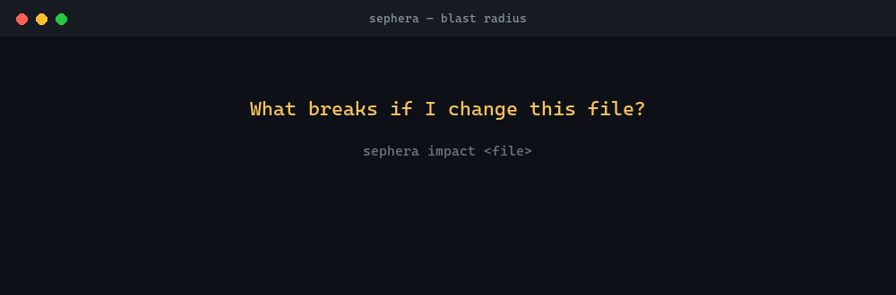
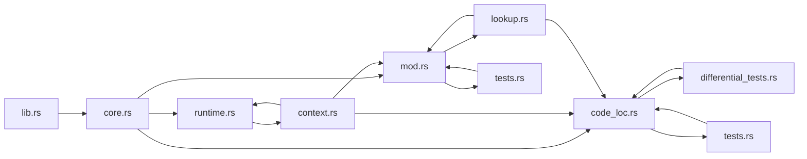
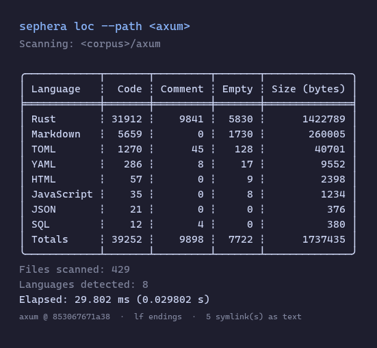

# Sephera

[](https://github.com/Reim-developer/Sephera/actions/workflows/ci.yml)
[](https://crates.io/crates/sephera)
[](https://sephera.vercel.app)
[](LICENSE)

**Know what breaks before you touch it.**

You are about to edit a shared module. Which files depend on it?

`grep` finds text matches, not call paths. Your IDE guesses. An LLM hallucinates a confident wrong answer.

Sephera builds a real dependency graph from your actual `import` / `use` / `#include` statements, then answers that question exactly.

```bash
cargo install sephera
```

---

## The graph is checked against real repositories

A dependency tool that reports confident nonsense is worse than no tool. So the
numbers are measured on three real projects at pinned commits, asserted in CI,
and reproducible:

```bash
python scripts/fetch_corpus.py      # clone the three repositories
python scripts/measure_accuracy.py --verify
```

```
repository  files  internal  self-refs  unresolved  cycles  cfg-gated
----------  -----  --------  ---------  ----------  ------  ---------
      axum    307       640         66           8      19         86
     flask     80       185          5           0      43          0
   express    141       159          0           0       0          0
```

`unresolved` counts imports meant for this project that could not be placed to a
file — the honest measure of what the tool failed at. `self-refs` are references
a file makes to itself, counted apart because a `use super::*;` in a test module
says nothing about how files depend on each other. `cfg-gated` counts edges that
only compile when a `#[cfg]` is on, so the number is not quietly inflated by
dependencies a default build does not have.

The `axum` row is the honest one. An earlier version reported **66 unresolved
paths and 54 cycles** on it. Those were module-tree artifacts — a parent
declaring a child and the child naming its parent with `super::` — not
dependencies anyone could act on, and this README advertised two of them as bugs
found in this repository's own source. The graph now reports 8 and 19.

That cycle count went up by one when it went down by nineteen. Fixing the
artifact also removed the `mod child;` edges from the graph entirely, which had
been hiding real rings: the nineteenth is `response/mod.rs` and
`test_helpers/mod.rs` importing each other, which no edit can undo. Cycle
detection now drops declaration edges by kind, where the blast radius keeps
them.

Getting there was mostly measurement rather than design. Reading import
statements by splitting text produced paths like `typing as t`,
`pbkdf2-password')(`, and `as origin } from './b'`; treating every `use` as a
re-export made a path resolve to the file that wrote it; and applying a name
lookup to unqualified paths resolved every example's first `use axum::Router` to
the example itself, inventing 934 self-edges. Each is a commit message with the
count that caught it.

---

## See it work

You are about to change `parser.rs`. Which files break?



Four files. Three import names from it; the fourth only declares `mod parser;`,
which still breaks when you delete or rename it.

That is the whole answer, and it took one command.

The recording runs on a five-file project in [`docs/demo/fixture`](docs/demo/fixture)
rather than on this repository, for two reasons. The report has to fit one screen:
on a 1,400-file repository the summary scrolls away before the reader sees it.
And the output is fixed, so the recording still shows the same four files as this
repository grows.

It is rendered from a committed capture of real output, not screen-recorded, so
it can be re-made:

```bash
sephera impact src/parser.rs --path docs/demo/fixture > scripts/fixtures/impact-query.md
python scripts/make_graph_demo.py impact
```

The full report is a separate command. `impact` answers the blast radius and stops;
`graph` answers it *and* shows every edge, the cycles, and the resolver's own
accounting of what it could not place. It is a different question on a different
file — this repository, not the fixture:


```bash
sephera graph --path . --what-depends-on crates/sephera_core/src/core/code_loc.rs --format markdown
```

````markdown
# Dependency Graph Report

**Base path:** `.`

**Query:** `depends_on:crates/sephera_core/src/core/code_loc.rs`

## Summary

| Metric | Value |
|--------|-------|
| Files analyzed | 10 |
| Internal edges | 43 |
| External edges | 21 |
| Self-references (excluded above) | 2 |
| Declared dependencies | 9 |
| Local crate edges | 0 |
| Standard library edges | 12 |
| Circular dependencies | 0 |

## Blast radius for `crates/sephera_core/src/core/code_loc.rs`

**5 files import it directly.**

| File | Imports from it |
|------|------------------|
| `crates/sephera_core/src/core.rs` | `self::code_loc` |
| `crates/sephera_core/src/core/code_loc/differential_tests.rs` | `super::LocMetrics`, `super::scan_content` |
| `crates/sephera_core/src/core/code_loc/tests.rs` | `super::CodeLoc`, `super::IgnoreMatcher`, `super::LocMetrics`, `super::scan_content` |
| `crates/sephera_core/src/core/runtime/context.rs` | `crate::core::code_loc::IgnoreMatcher` |
| `crates/sephera_core/src/core/symbols/lookup.rs` | `crate::core::code_loc::IgnoreMatcher` |

**4 further files reach them indirectly**, through the files above.

## Dependencies

| Package | Kind | Version | Import paths |
|---------|------|---------|--------------|
| `std` | stdlib | unknown | 12 |
| `anyhow` | declared | 1.0.102 | 5 |
| `tempfile` | declared | 3.27.0 | 4 |

## Most Imported Files

| File | Imported by |
|------|-------------|
| `crates/sephera_core/src/core/symbols/mod.rs` | 11 |
| `crates/sephera_core/src/core/runtime/context.rs` | 10 |
| `crates/sephera_core/src/core/code_loc.rs` | 9 |
| `crates/sephera_core/src/core/symbols/lookup.rs` | 5 |
| `crates/sephera_core/src/core/runtime.rs` | 4 |
| `crates/sephera_core/src/core.rs` | 1 |
| `crates/sephera_core/src/core/code_loc/differential_tests.rs` | 1 |
| `crates/sephera_core/src/core/code_loc/tests.rs` | 1 |
| `crates/sephera_core/src/core/symbols/tests.rs` | 1 |

## Most Importing Files

| File | Imports |
|------|---------|
| `crates/sephera_core/src/core/runtime.rs` | 10 |
| `crates/sephera_core/src/core/runtime/context.rs` | 6 |
| `crates/sephera_core/src/core/symbols/lookup.rs` | 6 |
| `crates/sephera_core/src/core/symbols/mod.rs` | 6 |
| `crates/sephera_core/src/core/code_loc/tests.rs` | 4 |
| `crates/sephera_core/src/core.rs` | 3 |
| `crates/sephera_core/src/core/symbols/tests.rs` | 3 |
| `crates/sephera_core/src/core/code_loc.rs` | 2 |
| `crates/sephera_core/src/core/code_loc/differential_tests.rs` | 2 |
| `crates/sephera_core/src/lib.rs` | 1 |

## Dependency Diagram


```mermaid
graph LR
    n0["core.rs"]
    n1["code_loc.rs"]
    n2["differential_tests.rs"]
    n3["tests.rs"]
    n4["runtime.rs"]
    n5["context.rs"]
    n6["lookup.rs"]
    n7["mod.rs"]
    n8["tests.rs"]
    n9["lib.rs"]
    n0 --> n1
    n0 --> n4
    n0 --> n7
    n1 --> n2
    n1 --> n3
    n2 --> n1
    n3 --> n1
    n4 --> n5
    n5 --> n1
    n5 --> n7
    n5 --> n4
    n6 --> n7
    n6 --> n1
    n7 --> n6
    n7 --> n8
    n8 --> n7
    n9 --> n0
```
````

**Nine files reach `code_loc.rs`, five of them importing it directly.** You now know your blast radius before opening the file - not after CI turns red.

The query filters to the blast radius, which is why the report above shows ten files rather than the whole repository. `core.rs` is among them because `mod code_loc;` is a real edge: delete the file and the crate root stops building.

---

## It finds real bugs

Run the full graph scan on this repository:

```bash
sephera graph --path . --format markdown
```

Real output:

````markdown
# Dependency Graph Report

**Base path:** `.`

## Summary

| Metric                | Value |
|-----------------------|-------|
| Files analyzed        | 179   |
| Internal edges        | 636   |
| External edges        | 809   |
| Self-references (excluded above) | 76 |
| Declared dependencies | 210   |
| Local crate edges     | 152   |
| Standard library edges| 217   |
| Circular dependencies | 0     |

## Dependencies

| Package            | Kind     | Version   | Import paths |
|--------------------|----------|-----------|--------------|
| `std`              | stdlib   | unknown   | 217 |
| `sepheracore`      | workspace| unknown   | 145 |
| `anyhow`           | declared | 1.0.102   | 65  |
| `tempfile`         | declared | 3.27.0    | 38  |
| `comfytable`       | declared | 7.2.2     | 12  |
| `clap`             | declared | 4.6.0     | 10  |
````

The three numbers that used to be one are now three: 152 edges reach a crate in this workspace and 217 reach the standard library, so the 809 "external" edges are mostly other people's code. That is what makes the table answer *"which dependency do I bump"* rather than just *"how many edges are there"*.

Cycles are found by iterative DFS over the resolved import graph, with back-edge
detection and deduplication so each cycle is reported once. This repository
reports 0, and it took real fixes to get there: the cycles it used to report were
module-tree artifacts — a parent declaring a child and the child naming its parent
with `super::` — not dependencies you could act on. An early version of this tool
advertised two "found in its own source tree" cycles for exactly that reason.

A cycle is only reported when every link in it is something an edit can remove.
`mod child;` is filtered out of cycle detection by kind, because no change to
either file breaks the pair — but it is kept in the blast radius, because
editing the child really does force the parent to rebuild. Keeping those two
answers separate is what took axum from 54 cycles to 19 rather than merely
suppressing them.

---

## Where Sephera fits

Being straight about this, because the crowded ones do not:

| Capability | Sephera | repomix | cloc / tokei |
|---|:---:|:---:|:---:|
| **Reverse dependencies** — what breaks if I edit this? | ✅ | ❌ | ❌ |
| **Circular dependency detection** | ✅ | ❌ | ❌ |
| **Graph export** — DOT, Mermaid, XML, JSON | ✅ | ❌ | ❌ |
| **Token-budgeted context packs** | ✅ | ✅ | ❌ |
| Tree-sitter AST compression | ✅ | ✅ | ❌ |
| Pack a repo into one AI-friendly file | ✅ | ✅ | ❌ |
| MCP server | ✅ | ✅ | ❌ |
| Claude Code plugins / Agent Skills | ❌ | ✅ | ❌ |
| Browser & VS Code extensions | ❌ | ✅ | ❌ |
| Code / comment / blank per-language LOC | ✅ | ❌ | ✅ |
| Single static Rust binary, no runtime deps | ✅ | ❌ (Node) | ✅ |
| Remote repo URL, no manual clone | ✅ | ✅ | ❌ |

**Read that honestly:** if you want a repo flattened into one XML file with a browser extension and Claude Code plugins, use [repomix](https://github.com/yamadashy/repomix). It is excellent and far more popular.

Use Sephera when you need the **dependency structure** — what imports this, what would break, are there cycles, and how do I fit this within a token budget.

---

## Install

```bash
cargo install sephera
```

No Rust toolchain? Grab a prebuilt binary from [GitHub Releases](https://github.com/Reim-developer/Sephera/releases) for Windows, macOS, or Linux.

Current release line: `v0.5.0` (pre-1.0).

---

## The commands

### `impact` — what breaks if you change this file

The question a reviewer or a pre-commit hook asks before an edit. Answers it
directly, so you do not have to know that `graph` has a flag for it.

```bash
# What transitively imports this file? 9 files do.
sephera impact crates/sephera_core/src/core/code_loc.rs

# Only the 5 files that import it directly
sephera impact crates/sephera_core/src/core/code_loc.rs --depth 1

# Several files at once, widest first; the graph is built once
sephera impact crates/sephera_core/src/core/code_loc.rs crates/sephera_cli/src/run.rs

# Machine-readable, for a script
sephera impact crates/sephera_core/src/core/ignore.rs --format json

# Fail the build when one file reaches more than 40 dependents
sephera impact crates/sephera_core/src/core/ignore.rs --fail-on 40
```

`--fail-on` exits **2**, which is deliberately different from the **1** that
means the analysis could not run. A broken install and a violated rule look the
same in a log otherwise, and that is where someone adds `--ignore-failures` to
the workflow and then never notices either.

### `graph` — dependency structure and blast radius

Works on Rust, Python, TypeScript, JavaScript, Go, Java, C, and C++.

```bash
# Full dependency report
sephera graph --path .

# Human-readable with Mermaid diagram
sephera graph --path . --format markdown

# Blast radius: everything that transitively imports a file
sephera graph --path . --what-depends-on crates/sephera_core/src/core/code_loc.rs

# Limit how far the impact spreads
sephera graph --path . --what-depends-on crates/sephera_core/src/core/code_loc.rs --depth 1

# What does this change reach? Widest blast radius first.
sephera graph --path . --diff origin/master --format markdown

# Scope analysis to a subtree, export for Graphviz
sephera graph --path . --focus crates/sephera_core --format dot --output deps.dot

# Analyze any public repo without cloning it yourself
sephera graph --url https://github.com/owner/repo --format markdown
```

`--what-depends-on` traverses the graph **in reverse** from the target, so you get real transitive dependents rather than direct importers.

`--diff` answers the pull-request question: it reports the blast radius of
*every* file the change touched, widest first. The graph is built once and each
changed file is measured against it, so the cost does not scale with the size of
the diff. Deleted files are skipped and listed separately — a file that no
longer exists has no blast radius.

### Enforcing it in CI

Three thresholds turn a report into a gate. Each prints its report as usual and
changes only the exit code.

```bash
# Fail on an import cycle. This repository has none, so it exits 0.
sephera graph --path . --fail-on-cycles 1

# Fail when the resolver cannot place a project's own import paths.
# Also none here, so also exits 0.
sephera graph --path . --fail-on-unresolved 1

# Fail when one file reaches more than 40 dependents.
# `run.rs` has 1, so this exits 0.
sephera impact crates/sephera_cli/src/run.rs --fail-on 40
```

### `context` — token-budgeted packs for LLMs

```bash
# Focus a subtree, compress, and cap the budget
sephera context --path . --focus crates/sephera_core --compress signatures --budget 32k

# Build a review pack from Git changes
sephera context --path . --diff HEAD~1 --budget 32k

# Machine-readable output
sephera context --path . --format json --output reports/context.json
```

AST compression (`--compress signatures` or `skeleton`) uses Tree-sitter to keep function signatures, types, imports, and trait declarations while replacing bodies with `{ ... }`.

Measured on 12 uncompressed Rust files from this repo:

| File | Raw | `signatures` | Reduction |
|---|---:|---:|---:|
| `line_slices.rs` | 1,294 | 160 | 87.6% |
| `ignore.rs` | 2,634 | 534 | 79.7% |
| `ranker.rs` | 968 | 218 | 77.5% |
| `budget.rs` | 1,410 | 433 | 69.3% |
| `reader.rs` | 1,394 | 469 | 66.4% |
| `config.rs` | 1,399 | 525 | 62.5% |
| **aggregate** | **15,488** | **6,602** | **57.4%** |

The API surface survives — signatures, types, imports, and traits are all still there, only bodies are replaced.

**Where that number stops applying.** The figure above is whole files, chosen for having large function bodies — the case compression is built for. Two other cases behave differently, and both were measured rather than assumed:

- `--compress` compresses *excerpts*, not whole files. An excerpt is already mostly declarations, so compressing it saved **0.4%** across this repository (108,815 → 108,396 tokens). It is not the lever for the excerpt budget.
- A file that is almost entirely declarations can **grow**: `graph/plugins/mod.rs` went from 1,161 to 2,026 tokens, because `{ ... }` markers and retained signatures can exceed the bodies they replace. 4 of 238 files grew in that run.

The gain scales with how much of a file is body. Check before relying on it.

**Where it does not help:** files with no implementation to strip. `core.rs` and `lib.rs` are almost entirely `mod` declarations and type definitions, and came out 2–3% *larger*. Compression pays off in proportion to how much of a file is executable body, so point it at logic-heavy directories rather than expecting a flat rate.

Real pack metadata from this repo:

```markdown
| Field                  | Value            |
|------------------------|------------------|
| Focus paths            | crates/sephera_core/src/core/runtime |
| Budget tokens          | 8000             |
| Estimated total tokens | 7475             |
| Files considered       | 148              |
| Files selected         | 13               |
```

Packs are **deterministic** — same inputs, same bytes out — which makes them usable in CI.

### `loc` — per-language line counts



Code, comment, and empty-line counts per language, from Tree-sitter rather than
pattern matching, so a `//` inside a string is not a comment. It reads the
repository's own `.gitignore` and `.sepheraignore` while it walks.

That is [axum](https://github.com/tokio-rs/axum) at commit `8530676`, fetched by
`python scripts/fetch_corpus.py`. The image is generated by
`scripts/render_loc_table.py` rather than pasted as text, for a specific reason:
byte counts change with line endings, and a checkout without `core.symlinks`
turns axum's `README.md` — a symlink — into a fourteen-byte text file, which is
then one more file and one more Markdown line. Both belong to your machine, not
to the tool, so your numbers will differ slightly and that is expected. The
caption in the image states which checkout produced it.

If you only need raw counts, `cloc` and `tokei` are fine — use Sephera when you
want the next step.

`loc` also speaks machine, so it can go straight into a dashboard or a CI step:

```bash
sephera loc --path . --format json --output reports/loc.json
sephera loc --path . --format csv
sephera loc --path . --format markdown
```

### `mcp` — expose it all to your AI agent

```bash
sephera mcp
```

Serves `loc`, `symbols`, `context`, `graph`, and `impact` as tools over stdio for Claude Desktop, Claude Code, Cursor, and any MCP-compatible client. `impact` is the one an agent should call before editing a file: it shares its counting with the command, so the answer an agent gets and the answer you get are the same one.

```json
{
  "mcpServers": {
    "sephera": {
      "command": "sephera",
      "args": ["mcp"]
    }
  }
}
```

---

## Configuration

Stop typing the same flags. `.sephera.toml` holds defaults, named profiles, and
whole commands under one word:

```toml
# Read by every command: loc, symbols, context, graph, impact, watch
[project]
ignore = ["vendor", "benchmarks/**"]
progress = "never"

# Each command's own flags
[loc]
format = "markdown"
output = "reports/loc.md"

[graph]
depth = 2
exclude_types = true

[impact]
fail_on = 40

# A second set of defaults, per command
[profiles.review.context]
diff = "origin/master"
budget = "32k"

# A whole long invocation, under one word
[aliases.who]
command = "graph"
what_depends_on = "crates/sephera_core/src/core/code_loc.rs"
format = "markdown"
```

```bash
sephera loc
```

With a `[profiles.ci.*]` block in place, a profile is one flag — and a name that
does not exist is an error rather than a silent no-op:

```console
$ sephera graph --profile ci
```

The alias is a word from *your* config file, so neither can be run here:

```console
$ sephera who                 # graph --what-depends-on src/lib.rs --format markdown
```

Three things make this predictable. Explicit flags still win, because config is
applied by rewriting the command line ahead of what you typed. `[project]` exists
because a repository that wants `vendor` out of its analysis should say so once,
not repeat `--ignore` on every command — which is how a project ends up with three
ignore lists and no idea which one a number came from. And a key that no section
accepts is an error naming the correction, not a setting that quietly does
nothing: `ignroe` is refused with "did you mean `ignore`?", because a typo that
did nothing is invisible until a number comes out wrong and you cannot work out
why.

`--no-config` ignores the file, and `--config <file>` reads a specific one.

---

## Scope

Sephera is deliberately narrow. It is not an agent runtime, not a hosted service, and not a provider-specific wrapper. It is a local, dependency-light analysis binary.

- Documentation: <https://sephera.vercel.app>
- Workspace: `sephera_cli`, `sephera_core`, `sephera_mcp`, `sephera_tools`
- Development checks: `cargo fmt --all --check`, `cargo clippy --workspace --all-targets --all-features -- -D warnings`, `cargo test --workspace`

## License

[GPL-3.0](LICENSE)
