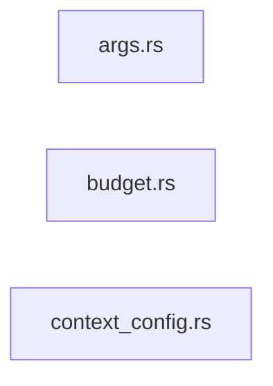

The `graph` command uses Tree-sitter to parse native import statements across your codebase and construct a semantic dependency graph.

It supports Cycle Detection, Metric Overviews (identifying highly coupled nodes), and can export the graph to JSON, Markdown (with a Mermaid diagram), XML, or Graphviz DOT formats for downstream visualization.

```bash
sephera graph [OPTIONS]
```

## Basic Usage

Run dependency analysis on the current directory and output to terminal as JSON (the default format):

```bash
sephera graph --path .
```

Analyze a remote repository directly:

```bash
sephera graph --url https://github.com/Reim-developer/Sephera --format markdown
```

Analyze a GitHub or GitLab tree URL directly:

```bash
sephera graph --url https://github.com/Reim-developer/Sephera/tree/master/crates/sephera_core --format json
```

Export a human-readable Markdown report:

```bash
sephera graph --path . --format markdown --output docs/dependencies.md
```

Export a Graphviz DOT file for interactive plotting:

```bash
sephera graph --path . --format dot --output deps.dot
```

## Sample Output

```markdown
# Dependency Graph Report

**Base path:** `crates`

## Summary

| Metric | Value |
|--------|-------|
| Files analyzed | 82 |
| Internal edges | 48 |
| External edges | 495 |
| Circular dependencies | 0 |

## Most Imported Files

| File | Imported by |
|------|-------------|
| `sephera_core/src/core.rs` | 42 |
| `sephera_core/tests/support/loc_matrix.rs` | 6 |

## Most Importing Files

| File | Imports |
|------|---------|
| `sephera_core/src/core/context/builder.rs` | 17 |
| `sephera_core/src/core/graph/resolver.rs` | 7 |
| `sephera_core/tests/comment_style_matrix.rs` | 6 |

## Dependency Diagram



## Options

### `--path <PATH>`

The root directory of the codebase to analyze locally. Defaults to the current working directory when `--url` is not provided.

### `--url <URL>`

Clone and analyze a remote repository directly.

- supports cloneable repo URLs such as HTTPS, SSH, SCP-style `git@host:org/repo.git`, and `file://`
- supports GitHub tree URLs like `https://github.com/org/repo/tree/ref/subdir`
- supports GitLab tree URLs like `https://gitlab.com/group/project/-/tree/ref/subdir`
- tree URLs scope the analysis to the pointed subdirectory, so `--focus` and `--what-depends-on` stay relative to that subtree

`--path` and `--url` are mutually exclusive.

### `--ref <REF>`

Check out a specific branch, tag, or commit before analysis.

```bash
sephera graph --url https://github.com/Reim-developer/Sephera --ref v0.5.0 --format markdown
```

`--ref` only applies to repo URLs. Tree URLs already encode the ref in the URL and reject `--ref`.

### `--focus <PATHS...>`

One or more relative paths to focus the analysis on. If provided, Sephera treats matching files as traversal roots and includes their dependency subgraph.

Paths are resolved relative to the selected analysis base:

- local `--path`
- the repo root for repo URLs
- the tree subdirectory for tree URLs

```bash
sephera graph --path . --focus crates/sephera_core crates/sephera_cli
```

### `--what-depends-on <PATH>`

Finds all files in the repository that import the specified file. Useful for assessing the impact of changing a core utility file.

```bash
sephera graph --path . --what-depends-on src/utils.ts
```

The path must resolve to an analyzed file inside the selected analysis base. When this flag is set, Sephera traverses the graph in reverse from the target node instead of following normal imports outward.

### `--depth <DEPTH>`

Maximum traversal depth applied when `--focus` or `--what-depends-on` is active. Defaults to unlimited.

- `0`: keep the traversal roots plus their direct neighbors
- `1`: include one more transitive hop
- omitted: include the full reachable subgraph

When neither `--focus` nor `--what-depends-on` is provided, Sephera returns the full graph and ignores `--depth`.

### `--format <FORMAT>`

The output format to generate.

- `json` (default): A structured JSON document containing metrics, lists of nodes, and edges.
- `markdown`: A human-readable Markdown report including statistics, circular dependency warnings, and a top-level `mermaid` diagram.
- `xml`: Structured XML representation (useful for LLM agent integration).
- `dot`: A valid [Graphviz DOT](https://graphviz.org/doc/info/lang.html) representation.

### `--output <FILE>`

Write the generated report to the specified file path instead of standard output. If the file exists, it will be overwritten.

### `--ignore <PATTERNS...>`

Additional glob patterns to ignore during traversal, appended to patterns found in `.gitignore` and `.sepheraignore`.

## URL Mode Notes

- Repo URLs are cloned into a temporary checkout for each invocation.
- Report output keeps the logical URL or tree URL as the base path instead of leaking the temp checkout path.
- Tree URLs analyze only the referenced subdirectory.
- `graph` URL mode supports repo URLs plus GitHub and GitLab tree URLs. Blob URLs are intentionally rejected.

## Supported Languages

Sephera's graph engine currently extracts import statements from:

- Rust
- Python
- TypeScript
- JavaScript
- Go
- Java
- C
- C++

## How It Works

1. **Traversal:** Sephera walks the target directory, honoring ignore rules and collecting analyzable source files.
2. **Extraction:** It applies language-specific Tree-sitter parsing to extract `use`, `import`, `require`, and `include` directives.
3. **Resolution:** It resolves internal imports to canonical file paths across the repository, including Rust module paths and Python relative imports.
4. **Selection:** It optionally narrows the full graph by focused entry points, reverse dependency queries, and traversal depth.
5. **Cycle Detection:** It runs cycle detection on the final in-scope internal graph.
6. **Rendering:** Output is routed to the corresponding format generator, with selection metadata included in JSON, Markdown, and XML.

## Circular Dependencies

If Sephera detects circular dependencies (where File A imports File B, which loops back to A), they will be explicitly flagged in the `markdown`, `json`, and `xml` metric reports to help you refactor tightly coupled sub-systems.
