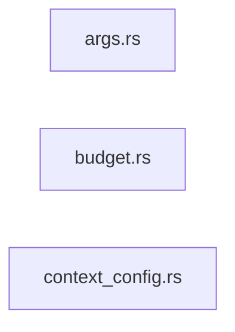

The `graph` command uses Tree-sitter to parse native import statements across your codebase and construct a semantic dependency graph.

It supports Cycle Detection, Metric Overviews (identifying highly coupled nodes), and can export the graph to JSON, Markdown (with a Mermaid diagram), XML, or Graphviz DOT formats for downstream visualization.

```bash
sephera graph [OPTIONS]
```

## Basic Usage


Run dependency analysis on the current directory and output to terminal as JSON (the default format):

```bash
sephera graph --path .
```

Analyze a remote repository directly:

```bash
sephera graph --url https://github.com/Reim-developer/Sephera --format markdown
```

Analyze a GitHub or GitLab tree URL directly:

```bash
sephera graph --url https://github.com/Reim-developer/Sephera/tree/master/crates/sephera_core --format json
```

Export a human-readable Markdown report:

```bash
sephera graph --path . --format markdown --output docs/dependencies.md
```

Export a Graphviz DOT file for interactive plotting:

```bash
sephera graph --path . --format dot --output deps.dot
```

Report what a change reaches, widest blast radius first:

```bash
sephera graph --path . --diff origin/master --format markdown
```

## What a change reaches

`--diff` answers the pull-review question: instead of describing the whole
repository, it reports the blast radius of *every* file the change touched,
sorted so the file whose change would break the most is first.

```bash
sephera graph --path . --diff HEAD~1 --format json
```

It accepts a ref (`HEAD~1`, `origin/master`) or the keywords `working-tree` and
`staged`, with the same meanings `context --diff` gives them.

The graph is built **once** and each changed file is measured against it, so the
cost does not grow with the size of the diff. Deleted files are skipped and
listed separately, because a file that no longer exists has no blast radius and
reporting it as "0 dependents" would put a line in a review that reads like a
finding.

For a single file rather than a change, [`impact`](/commands/impact/) is the
direct route.

## Failing a build

Two thresholds turn the report into a gate. Both print the report as usual and
change only the exit code.

```bash
# Exit 2 at the first import cycle
sephera graph --path . --fail-on-cycles 1

# Exit 2 when the resolver cannot place the project's own import paths
sephera graph --path . --fail-on-unresolved 1
```

An unresolved local path was meant to name a file in this project and was not
found. That is a resolver gap, not a dependency, and a blast radius that counts
one silently omits a file.

Exit code **2** means a threshold was crossed; **1** means the analysis could not
run. Keeping them distinct means a broken install does not look like a violated
rule in a log.

## Sample Output

```markdown
# Dependency Graph Report

**Base path:** `crates/sephera_cli`

## Summary

| Metric | Value |
|--------|-------|
| Files analyzed | 29 |
| Internal edges | 89 |
| External edges | 160 |
| Declared dependencies | 104 |
| Local crate edges | 1 |
| Standard library edges | 55 |
| Circular dependencies | 0 |

`Unresolved local paths` and `Feature-gated edges` appear only when non-zero. The first counts imports meant for this project that the resolver could not place; the second counts edges that only compile when a `#[cfg]` is on, so a blast radius that counted them silently would claim a dependency the build may not have.

## Dependencies

| Package | Kind | Version | Import paths |
|---------|------|---------|--------------|
| `std` | stdlib | unknown | 55 |
| `sepheracore` | declared | unknown | 37 |
| `anyhow` | declared | unknown | 17 |
| `tempfile` | declared | unknown | 12 |
| `sephera` | workspace | unknown | 1 |

Unresolved edges are attributed to real packages by reading the manifests at the base path: `Cargo.toml` and `Cargo.lock`, `package.json`, `go.mod`, `requirements.txt`. This separates three things that all used to be counted as one "external" number:

- **declared** — named by a manifest, so a version is known when the lockfile records one
- **workspace** — a crate in this repository, reached by name rather than by path
- **stdlib** — provided by the language, so there is nothing to manage

Versions resolve when a lockfile is found at the base path. Analysing a subdirectory therefore reports `unknown`, because the manifest sits above the path given to `--path`; point `--path` at the repository root to get them.

## Most Imported Files

| File | Imported by |
|------|-------------|
| `src/args.rs` | 20 |
| `src/context_config/types.rs` | 16 |

## Most Importing Files

| File | Imports |
|------|---------|
| `src/run.rs` | 25 |
| `src/context_config/resolve.rs` | 17 |
| `src/context_config/load.rs` | 5 |

## Dependency Diagram


```mermaid
graph LR
    n0["args.rs"]
    n1["budget.rs"]
    n2["context_config.rs"]
    %% ... remaining edges and nodes ...
```

## Options

### `--path <PATH>`

The root directory of the codebase to analyze locally. Defaults to the current working directory when `--url` is not provided.

### `--url <URL>`

Clone and analyze a remote repository directly.

- supports cloneable repo URLs such as HTTPS, SSH, SCP-style `git@host:org/repo.git`, and `file://`
- supports GitHub tree URLs like `https://github.com/org/repo/tree/ref/subdir`
- supports GitLab tree URLs like `https://gitlab.com/group/project/-/tree/ref/subdir`
- tree URLs scope the analysis to the pointed subdirectory, so `--focus` and `--what-depends-on` stay relative to that subtree

`--path` and `--url` are mutually exclusive.

### `--ref <REF>`

Check out a specific branch, tag, or commit before analysis.

```bash
sephera graph --url https://github.com/Reim-developer/Sephera --ref v0.5.0 --format markdown
```

`--ref` only applies to repo URLs. Tree URLs already encode the ref in the URL and reject `--ref`.

### `--focus <PATHS...>`

One or more relative paths to focus the analysis on. If provided, Sephera treats matching files as traversal roots and includes their dependency subgraph.

Paths are resolved relative to the selected analysis base:

- local `--path`
- the repo root for repo URLs
- the tree subdirectory for tree URLs

```bash
sephera graph --path . --focus crates/sephera_core crates/sephera_cli
```

### `--what-depends-on <PATH>`

Finds all files in the repository that import the specified file. Useful for assessing the impact of changing a core utility file.

```bash
sephera graph --path . --what-depends-on src/utils.ts
```

The path must resolve to an analyzed file inside the selected analysis base. When this flag is set, Sephera traverses the graph in reverse from the target node instead of following normal imports outward.

The direct and indirect lists are disjoint: a file that imports the target
directly is not also counted among those that reach it indirectly, and the
target itself is never listed as importing it. Both were once counted twice,
which made the section report a total larger than the number of files involved.

For the same answer as a standalone command, see [`impact`](/commands/impact/).

### `--diff <SPEC>`

Report the blast radius of every file changed against a Git base.

```bash
sephera graph --path . --diff origin/master --format markdown
```

Mutually exclusive with `--what-depends-on`, which answers about one named file
rather than about a change.

### `--fail-on-cycles <COUNT>` / `--fail-on-unresolved <COUNT>`

Exit **2** at or above the given count. The limit is the first *failing* value,
so `--fail-on-cycles 1` fails on a single cycle. Zero is rejected by the parser,
because a limit of zero would fail every run including the clean ones.

```bash
sephera graph --path . --fail-on-cycles 1 --fail-on-unresolved 1
```

### `--depth <DEPTH>`

Maximum traversal depth applied when `--focus` or `--what-depends-on` is active. Defaults to unlimited.

- `0`: keep the traversal roots plus their direct neighbors
- `1`: include one more transitive hop
- omitted: include the full reachable subgraph

When neither `--focus` nor `--what-depends-on` is provided, Sephera returns the full graph and ignores `--depth`.

The number is the number of **hops** from the traversal root, which is always
included. On a chain `c → b → a → target`:

| `--depth` | reached |
| --- | --- |
| `0` | `target` |
| `1` | `target`, `a` |
| `2` | `target`, `a`, `b` |
| `3` | `target`, `a`, `b`, `c` |

`sephera impact --depth` counts hops the same way, so the same flag number bounds
the same walk on both commands.

### `--format <FORMAT>`

The output format to generate.

- `json` (default): A structured JSON document containing metrics, lists of nodes, and edges.
- `markdown`: A human-readable Markdown report including statistics, circular dependency warnings, and a top-level `mermaid` diagram.
- `xml`: Structured XML representation (useful for LLM agent integration).
- `dot`: A valid [Graphviz DOT](https://graphviz.org/doc/info/lang.html) representation.

### `--output <FILE>`

Write the generated report to the specified file path instead of standard output. If the file exists, it will be overwritten.

### `--ignore <PATTERNS...>`

Additional patterns to exclude during traversal, applied after the patterns found in `.gitignore` and `.sepheraignore`. Globs match both the file name and the path relative to the base, so `dist/**` and `**/node_modules/**` each exclude a whole tree. Pass `--no-gitignore` to analyse the tree as it is on disk, which counts everything the repository excludes.

## URL Mode Notes

- Repo URLs are cloned into a temporary checkout for each invocation, and the checkout is deleted when the command finishes.
- The clone is **shallow** -- the branch tip only -- because the analysis reads the working tree rather than the history. On the Linux kernel that is roughly 1.3 GB instead of 6 GB. Naming a ref other than the branch tip with `--ref` needs the history to resolve it, so `--ref` clones in full.
- Report output keeps the logical URL or tree URL as the base path instead of leaking the temp checkout path.
- Tree URLs analyze only the referenced subdirectory.
- `graph` URL mode supports repo URLs plus GitHub and GitLab tree URLs. Blob URLs are intentionally rejected.

## Supported Languages

Sephera's graph engine currently extracts import statements from:

- Rust
- Python
- TypeScript
- JavaScript
- Go
- Java
- C
- C++

## How It Works

1. **Traversal:** Sephera walks the target directory, honoring ignore rules and collecting analyzable source files.
2. **Extraction:** It applies language-specific Tree-sitter parsing to extract `use`, `import`, `require`, and `include` directives.
3. **Resolution:** It resolves internal imports to canonical file paths across the repository, including Rust module paths and Python relative imports.
4. **Selection:** It optionally narrows the full graph by focused entry points, reverse dependency queries, and traversal depth.
5. **Cycle Detection:** It runs cycle detection on the final in-scope internal graph.
6. **Rendering:** Output is routed to the corresponding format generator, with selection metadata included in JSON, Markdown, and XML.

## Circular Dependencies

If Sephera detects circular dependencies (where File A imports File B, which loops back to A), they will be explicitly flagged in the `markdown`, `json`, and `xml` metric reports to help you refactor tightly coupled sub-systems.
