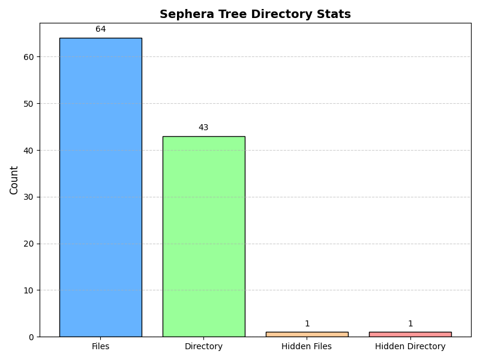
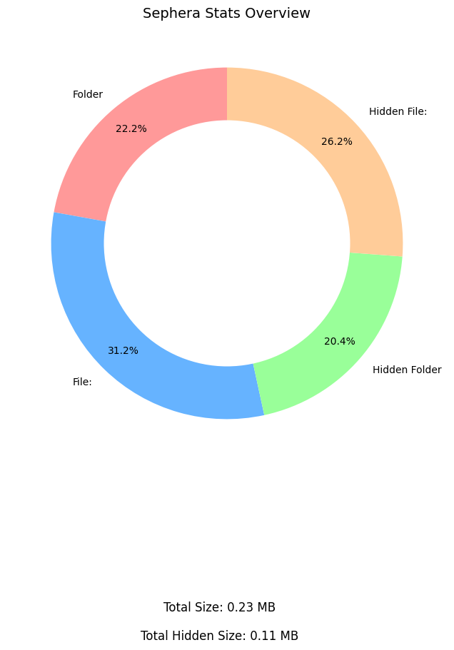

# Sephera

**Sephera** is a minimal yet powerful command-line tool for developers and general users. It provides directory tree viewing with support for regex-based ignoring and simple string filters.

--- 

### Features & Usage
- `tree` command to display directory structure visually.
**Arguments:**
- `--path <Directory Path>`
    - Example usage: `--path C:\MyAwesome\Project`
    - Supports full paths with proper error handling.

- `--ignore` option to exclude files or folders:
    - Supports both simple string matching (e.g. `"node_modules"`)
    - And full regex patterns (e.g. `"\.py$"`)

- `--chart [<File Name>]`:
    - Example usage: `--chart MySuperCoolChart`
    - Export a bar chart representing directory stats
    - Default file name is `SepheraChart.png` if no file name provided
    - Preview:
    ****

- `stats` command to show your directory/project stats
**Arguments:**
-`--path <Directory Path>`
    - Example usage: `--path C:\MyAwesome\Project`

- `--ignore`
    - Example usage `--ignore 'node_modules'`
    This will also support regex, like:
    - `--ignore '\.py$'`

- `--chart [<File Name>]`
    - Example usage: `--chart MySuperCoolChart`
    You can also customize save directory, like:
    - `--chart 'C:\Document\MySuperCoolChart'`
    - Preview
    ****

- Clean and readable tree output
- Full portable:
    - Use from release
    - Or clone & run manually
---

### LICENSE
Sephera is licensed under the GNU General Public License v3.0.
