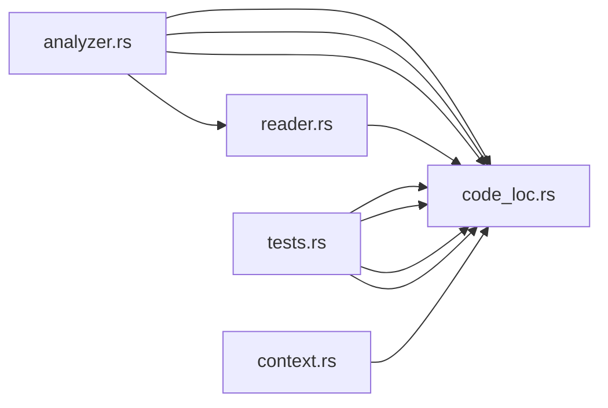

# Dependency Graph Report

**Base path:** `.`

**Query:** `depends_on:crates/sephera_core/src/core/code_loc.rs`

## Summary

| Metric | Value |
|--------|-------|
| Files analyzed | 5 |
| Internal edges | 10 |
| External edges | 29 |
| Circular dependencies | 0 |

## Most Imported Files

| File | Imported by |
|------|-------------|
| `crates/sephera_core/src/core/code_loc.rs` | 9 |
| `crates/sephera_core/src/core/code_loc/reader.rs` | 1 |

## Most Importing Files

| File | Imports |
|------|---------|
| `crates/sephera_core/src/core/code_loc/analyzer.rs` | 4 |
| `crates/sephera_core/src/core/code_loc/tests.rs` | 4 |
| `crates/sephera_core/src/core/code_loc/reader.rs` | 1 |
| `crates/sephera_core/src/core/runtime/context.rs` | 1 |

## Dependency Diagram

